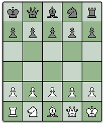
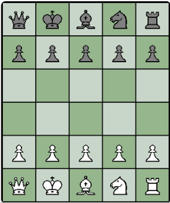

# Proyecto-Enroque-digital
Repositorio del trabajo de informática sobre las variantes Kramnik

## 5x6 reyes en esquinas opuestas
 Juego de mini ajedrez con los reyes en las esquinas opuestas para jugar contra el ordenador o entre dos. Esta variante tiene un tablero de 5x6 casillas. Sigue las reglas del Ajedrez estándar, los peones pueden avanzar de solo una casilla de su posición inicial, no hay enroque ni captura al paso. 

 
 
 ## Petty
 Juego del miniajedrez Petty que te permite de jugar con el ordenador o entre dos. Petty es una particular variante del mini ajedrez inventada en el 1930 por B. Walker Watson la cual tiene un tablero de 5x6 casillas. Sigue las reglas estándar del Ajedrez, el peón de su posición inicial puede ir adelante de solo una casilla, la captura al paso no es posible y no hay enroque.

 